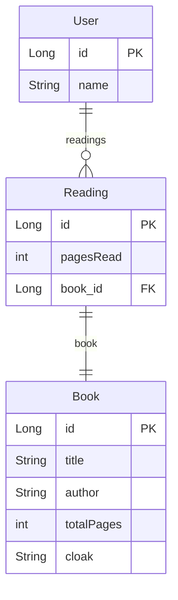
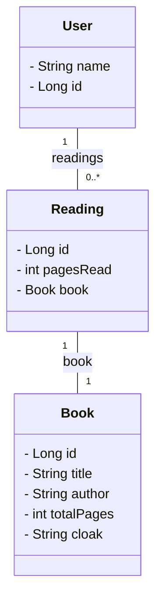

# Projeto prático API REST utilizando spring

Este projeto é uma implementação básica de uma API REST usando Spring, aplicando padrões de design como Facade, Repository e Strategy.

**Diagrama Entidade Relacionamento**

**Diagrama de classes**

